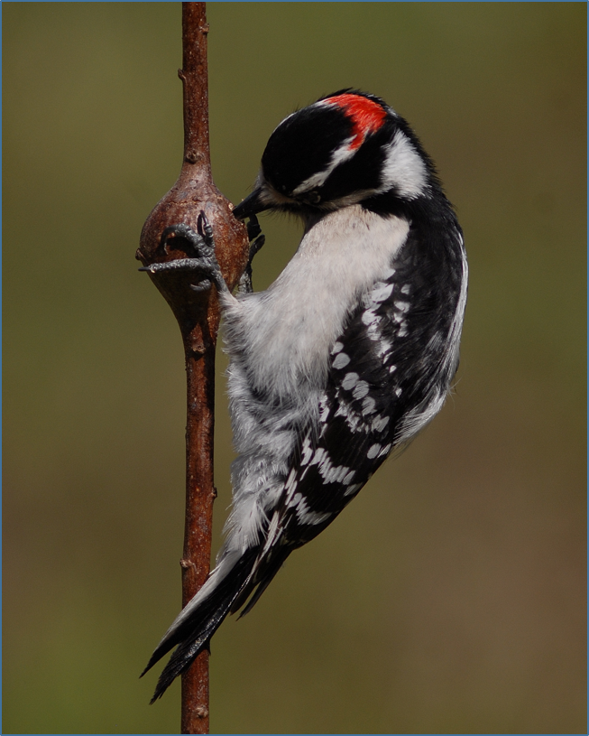

---
title: "Selective Pressures & Tropic Interactions Affecting Gall Size & Location on Goldenrod Stem"
author: "Luke Daniels"
date: "1/31/2018"
output: 
  fig.caption: yes
  beamer_presentation: 
    colortheme: lily
    theme: Hannover
incremental: yes 
---

```{r setup, include=FALSE}
knitr::opts_chunk$set(echo = FALSE)
```

## Background
\scriptsize
\

- \color{black} Galls existing on goldenrod are a model for understanding selection facing flies and plants 

- \color{red} Gall making flies use an ovipositor to stimulate chemical reactions that form a gall 

- \color{black} Parasitic wasps are limited to attacking small galls due to the legth of their ovipositor 

- \color{gray} Abrahamson W.G 1989 found directional selection towards the larger gall due to parasitic interactions. 


 


\begin{picture}(250,250)
\put(10,130){\includegraphics[height=4cm]{Bird.png}}
\put(120,130){\includegraphics[height=4cm]{Fly.png}}
\end{picture}


# Hypothesis (Sequential Bullets) 
 

>- Galls would exhibit stabilizing selection and would be most prevalent in the middle of the stem to avoid abiotic factors and predation or parasitism from ground wasps and birds 
 
>- \color{blue} Galls would exhibit stabilizing selection and would be intermediate in size , large enough to inhibit wasp ovipositors and small enough to avoid bird predation  


# Results 

```{r echo=FALSE, fig.height= 3.5, fig.width=2, fig.cap= 'Hello'}

Gall <- read.csv("Gall_RawData.csv")
attach(Gall)

boxplot(Height ~ GallState,
        ylab="Gall Height (cm)",
        xlab="State of Fly", 
        col= c("gray", "blue", "green", "yellow")
)

boxplot(Diameter ~ GallState,
        ylab="Gall Diameter (mm)",
        xlab="State of Fly",
        col= c("gray", "blue", "green", "yellow")
)


```

\center 
\tiny   

Figure 1. Heights where galls occur on goldenrod species for categories (p= 0.807).

Figure 2. Diameters of galls on goldenrod species separated by categories of larva fate.  There was a significant difference between diameter (p=0.0252).  These differences occurred between B & A (p= 0.037) (*) and  B & L (p=0.0327)(**)


# Text Overlay on Picture 

\begin{picture}(280,280)
\put(00,100){\includegraphics[height=18cm]{Gall2.jpg}}
\put(10,120){\begin{minipage}[t]{1\linewidth} 
{Thanks For Reading! (Adapted from BCOR102)}
\end{minipage}}
\end{picture}

